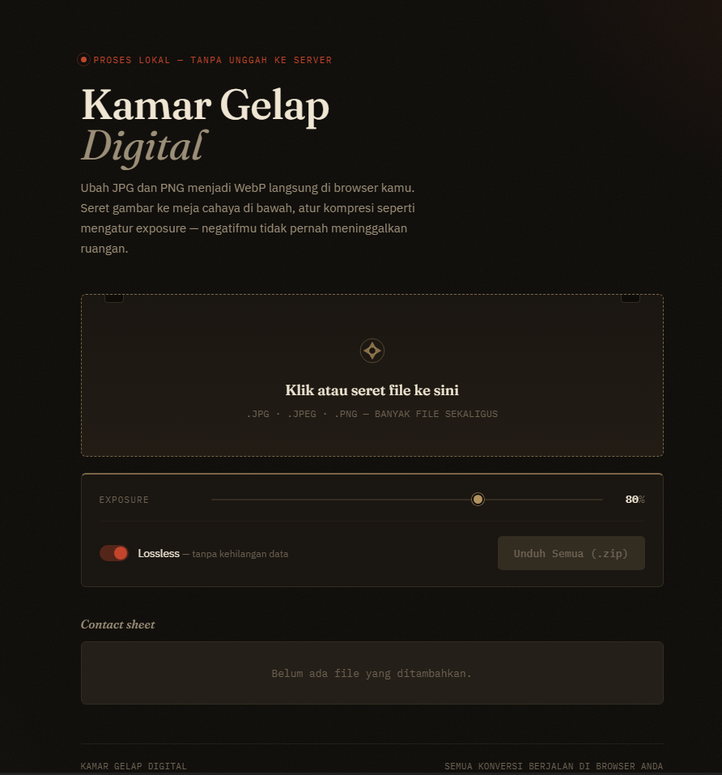

# 🎞️ Kamar Gelap Digital



**Kamar Gelap Digital** adalah aplikasi berbasis web untuk mengubah gambar berformat JPG dan PNG menjadi WebP secara instan. Semua proses dilakukan secara **lokal di dalam browser** (Client-side), sehingga privasi data terjamin—file gambar tidak pernah diunggah ke server mana pun.

## ✨ Fitur Utama

* **Privasi 100% (Proses Lokal):** Konversi dilakukan sepenuhnya di browser pengguna menggunakan JavaScript. Tidak ada pertukaran data dengan server.
* **Drag & Drop Sederhana:** Antarmuka yang intuitif layaknya "meja cahaya". Cukup seret dan lepas banyak file sekaligus.
* **Pengaturan Kompresi (Exposure):** Atur rasio kompresi WebP (0-100%) secara *real-time* untuk menyeimbangkan ukuran dan kualitas gambar.
* **Opsi Lossless:** Tersedia *toggle* khusus untuk konversi WebP tanpa kehilangan kualitas data (*lossless*).
* **Konversi Massal (Batch):** Mendukung pemrosesan banyak file sekaligus dan mengunduh semuanya dalam satu paket berekstensi `.zip`.
* **Contact Sheet:** Pratinjau daftar file yang sedang dan sudah diproses langsung di layar.

## 🚀 Cara Menjalankan (Development)

Karena aplikasi ini berjalan sepenuhnya di browser klien tanpa backend, kamu hanya perlu menjalankan *local server* statis untuk mengujinya. 

Jika kamu sudah menginstal **Node.js**, kamu bisa menggunakan `npx serve`:

```bash
# Pindah ke direktori proyek
cd path/to/kamar-gelap-digital

# Jalankan local server
npx serve .